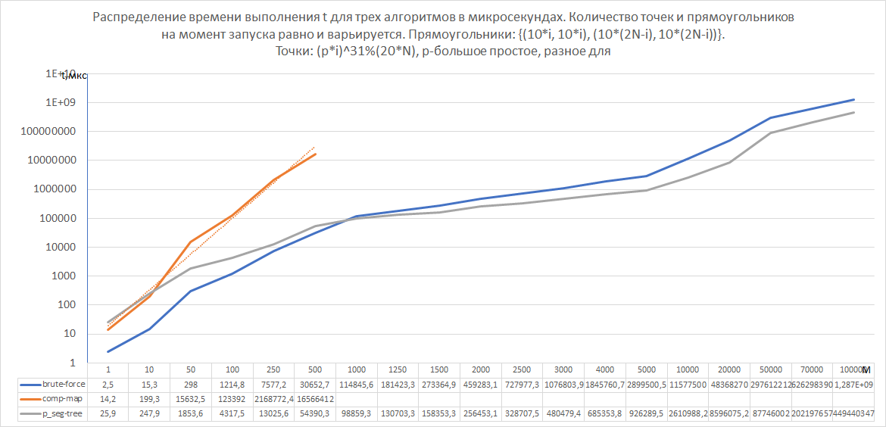
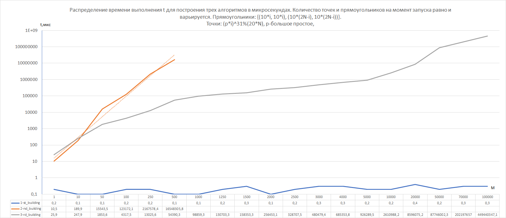
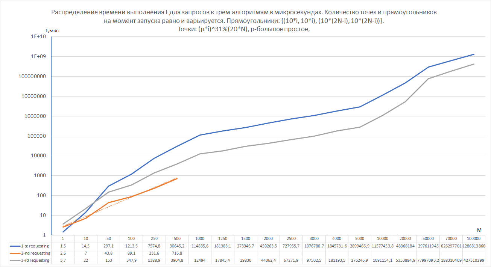

# Лабораторная работа по алгоритмам и структурам данных 2
Язык: Python 3.8
## Содержнание

0. [Основная идея](#Основная-идея)
1. [Наивное решение](#Наивное-решение)
2. [Сжатие координат, алгоритм на карте](#Сжатие-координат-алгоритм-на-карте)
3. [Сжатие координат, алгоритм на персистентном Д.О](#Сжатие-координат-алгоритм-на-персистентном-Д-О)
4. [Производительность](#Производительность)
5. [Выводы](#Выводы)

## Основная идея
____
Суть данной работы заключается в написании и исследовании трех различных алгоритмов,
которые представляют собой решение проблемы о нахождении количества прямоугольников, покрывающих точку на плоскости.
____
- Использовалось 3 подхода к решению данной задачи:
    - Наивное решение, состоящее в переборе всех прямоугольников для точки
    - Сжастие координат и построение карты
    - Сжатие координат и построение персистентного дерева отрезков

Все они будут рассмотрены ниже.
____
[:arrow_up:Оглавление](#Оглавление)

## Наивное решение
Данное решение не отличается какой-либо сложностью. По сути, мы просто проходим по всем объектам прямоугольников для
каждой имеющейся точки.
____
Перебор прямоугольников для каждой точки, метод have проверяет, принадлежит ли точка данному прямоугольнику:
```Python
count = 0
    counts = []
    for point in points:
        for rect in rectangles:
            if rect.have(point):
                count += 1
        counts.append(count)
        count = 0
```
____
[:arrow_up:Оглавление](#Оглавление)
## Сжатие координат, алгоритм на карте
____
Данная идея заключается в сжатии координат и последующей работы с ними путем использования бинарного поиска.
Построение карты - это создание матрицы размерности по x и y сжатых координат.
Заполнение матрицы - это проход по всем прямоугольникам и увеличение конкретной проекции данного прямоугольника на сжатых координатах и данной матрице на 1.
В конечном итоге, получив заполненную матрицу мы будем иметь возможность, получив обе координаты точки и сведя их к сжатым(через бинарный поиск), сделать запрос к матрице и получить ответ за константу.

____
Сжатие координат:
```Python
def fill_zipped_coord(rectangles):
    x_values = set()
    y_values = set()
    for rect in rectangles:
        x_values.add(rect.x1)
        x_values.add(rect.x2)
        y_values.add(rect.y1)
        y_values.add(rect.y2)
        x_values.add(rect.x2 + 1)
        y_values.add(rect.y2 + 1)

    x_values = sorted(x_values)
    y_values = sorted(y_values)
    return x_values, y_values
```
____
Построение карты и её заполнение(про bisect-ы: https://docs.python.org/3/library/bisect.html):
```Python
def fill_matrix(x_values, y_values, rectangles):
    matrix = [[0 for _ in range(len(x_values))] for _ in range(len(y_values))]
    for rect in rectangles:
        i1 = bisect_left(x_values, rect.x1)
        j1 = bisect_left(y_values, rect.y1)
        i2 = bisect_left(x_values, rect.x2)
        j2 = bisect_left(y_values, rect.y2)
        for i in range(i1, i2 + 1):
            for j in range(j1, j2 + 1):
                matrix[j][i] += 1
    return matrix
```
____
Получение результата(функция find_le, как и другие полезные функции, находится в modules/general_funcs.py):
```Python
def get_count(points, x_values, y_values, matrix):
    counts = []
    for point in points:
        if point.x < x_values[0] or point.y < y_values[0]:
            counts.append(0)
            continue
        x_index = find_le(x_values, point.x)
        y_index = find_le(y_values, point.y)
        count = matrix[y_index][x_index] if 0 <= x_index < len(x_values) and 0 <= y_index < len(y_values) else 0
        counts.append(count)
    return counts
```
____

## Сжатие координат, алгоритм на персистентном Д.О
____
Идея заключается в создании класса дерева, в котором будут реализованы методы изначального создания и персистентного обновления дерева, а также, которое будет хранить словарь со ссылками на конкретный корень дерева по запросу.
Дерево также работает со сжатыми координатами по тому же принципу, что и второй алгоритм.
Обновление дерева состоит в проходу по событиям открытия-закрытия имеющихся прямоугольников с логикой(на отрезке открытия(по y-координатам) мы увеличиваем на 1 все значения дерева), на отрезке закрытия - уменьшаем. X-координата будет нашим корнем.
Запрос состоит в получении корня по x-координате поданной точки, а спуск по дереву представляет собой проход до конкретного y-листа, собирая необходимые значения из обновлений.
Итоговый результат будет суммой собранных модификаторов на пути к листу + его возможное значение.
____
Построение дерева:
```Python
def build(self, start, end):
      if start == end:
          return self.Node(start, end)

      mid = (start + end) // 2
      left_child = self.build(start, mid)
      right_child = self.build(mid + 1, end)

      node = self.Node(start, end)
      node.left_child = left_child
      node.right_child = right_child
      return node
```
____
Обновление дерева(возвращает новый корень, раньше которого новые изменения получить будет невозможно - наша персистентность):
```Python
def update(self, root, start, end, value):
      if start > root.end or end < root.start:
          return root

      if start <= root.start and end >= root.end:
          new_root = self.Node(root.start, root.end)
          new_root.left_child = root.left_child
          new_root.right_child = root.right_child
          if new_root.left_child or new_root.right_child:
              new_root.modifier = root.modifier + value
          else:
              new_root.list_val = root.list_val + value
          return new_root

      new_root = self.Node(root.start, root.end)
      new_root.modifier = root.modifier
      new_root.left_child = self.update(root.left_child, start, end, value)
      new_root.right_child = self.update(root.right_child, start, end, value)
      return new_root
```
____
Создание последовательности событий(find_le в modules/general_funcs.py):
```Python
class Event:
    def __init__(self, compX=0, compY1=0, compY2=0, status_open=False):
        self.compX = compX
        self.compY1 = compY1
        self.compY2 = compY2
        self.status_open = status_open

def fill_events(rectangles, x_values, y_values):
    events = []
    for rect in rectangles:
        events.append(
            Event(find_le(x_values, rect.x1), find_le(y_values, rect.y1), find_le(y_values, rect.y2), True))
        events.append(
            Event(find_le(x_values, rect.x2 + 1), find_le(y_values, rect.y1), find_le(y_values, rect.y2), False))
    events = sorted(events, key=lambda x: x.compX)
    return events
```
____
Получение результатов(find_le, find_vale в modules/general_funcs.py)::
```Python
def count_rect(root, y_ind):
    count = 0
    while root:
        count += root.list_val + root.modifier
        if root.left_child and root.left_child.start <= y_ind <= root.left_child.end:
            root = root.left_child
        elif root.right_child and root.right_child.start <= y_ind <= root.right_child.end:
            root = root.right_child
        else:
            return count
    return count


def get_count(points, x_values, y_values, stree):
    counts = []
    for point in points:
        if point.x < x_values[0] or point.y < y_values[0]:
            counts.append(0)
            continue
        x_index = find_le(x_values, point.x)
        y_index = find_le(y_values, point.y)
        count = count_rect(stree.roots[find_vale(list(stree.roots.keys()), x_index)], y_index)
        counts.append(count)
    return counts
```
____

## Производительность

----
Ниже 3 графика замеров производительности(времени).
Входные данные и их создание находится по пути modules/test_func.py

Сырые данные можно найти в xlsx файле(raw data/сложность_алгоритмов)
### Все 3 алгоритма(логарифмический вид)



----
## Выводы

----
Во время измерения производительности было решено разбить время исполнения целого алгоритма
еще на измерение скорости предварительного построения и получения результатов по запросам.
Как мы можем увидеть из 2-го графика, самое быстрое построение происходило у наивного решения,
просто потому, что никаких предварительных действий там нет.
В двух других случаях мы имеем O(n^3) и O(n*logn) сложности для построения карты и дерева.
Безусловно, алгоритм на карте имеет наихудшую кубическую ассимптотику и работает очень медленно даже при небольшом количестве данных.
Было принято решение не рассматривать его дальше и не брать в расчет в целях экономии времени, затрачиваемого на выполнение программы, но очевидно, что работать он будет долго.

Что касается последнего графика, то тут уже интереснее.
Абсолютным лидером является алгоритм на карте, поскольку имеет очень маленькие константы, и фактически представляет собой эталонную логирифмическую сложность на запрос.
(Уточнение: графики показаны не для единичного запроса, а для множества точек = количеству прямоугольников)
Как раз из-за таких констант, наивный алгоритм лидировал по скорости изначально, поскольку входные данные там сравнительно малы.
Однако довольно быстро уступил алгоритму на карте и алгоритму на дереве.
К сожалению, алгоритм на дереве не может отразить идеальную логирифмическую сложность из-за большого количества констант и некоторой дополнительной работы, однако
на порядок превосходит скорость работы наивного алгоритма, к чему мы и стремились при его написании.

Наконец, рассматривая полную скорость выполнения, учитывая и построение и запросы, можно сказать, что алгоритм на карте имеет худшую ассимптотику.
Наивный алгоритм сохранял лидерство в скорости выполнения чуть дольше(до n=1000 во входных данных) за счет того, что в алгоритму на карте прибавлилось время его построения, однако, на больших данных
наивный алгоритм снова уступил в скорости, что длеает алгоритм на дереве лучшим в целом.
Алгоритм на карте был бы идеален, если бы предварительная подготовка не входила бы в его работу.
И, наконец, наивный алгоритм являеется средним между ними.

----
